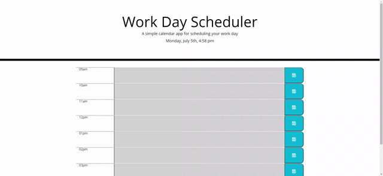

* Introduction

The deployed Webpage is a day planner for a day hour to hour planning. When you put an entry and click on the save icon the said entry will be saved even when the page is refreshed. The planner display color as grey is the past, red the present and green the future.

URL of the Web page:

https://tristanlibeau.github.io/Day-Planner/

URL of my Repository:

https://github.com/TristanLibeau

* Functionality:

The homework was to update a given HTML and to create a JavaScript to create a day planner that:

The current day is displayed at the top of the calendar

When you scroll down, you are presented with timeblocks for standard business hours

When you view the timeblocks for that day, each timeblock is color coded to indicate whether it is in the past, present, or future

When you click into a timeblock, you can enter an event

When you click the save button for that timeblock, the text for that event is saved in local storage

When you refresh the page, the saved events persist

Mock-Up
This is a Gif of the expected behavior.

* Credits

w3schools.com
StackOverflaw
BootCamp Course